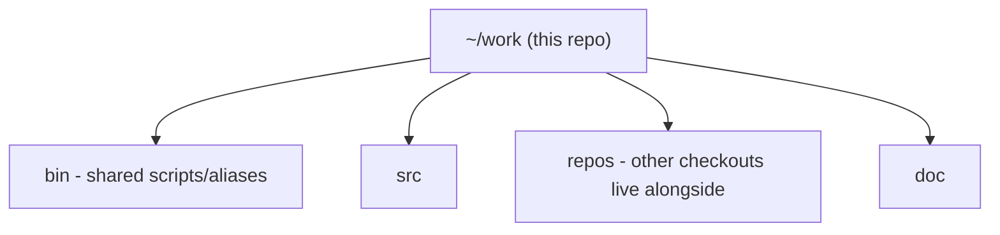

# WorkFolder Architecture

## Layout

```mermaid
flowchart TB
    W["~/work (this repo)"] --> BIN[bin - shared scripts/aliases]
    W --> SRC[src]
    W --> REPOS[repos - other checkouts live alongside]
    W --> DOC[doc]
```
